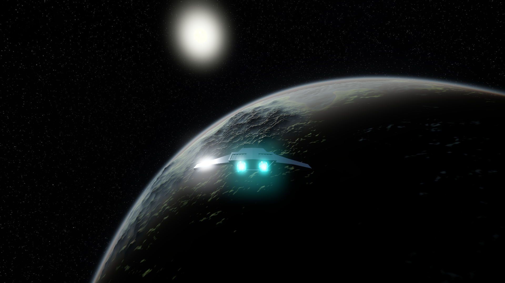
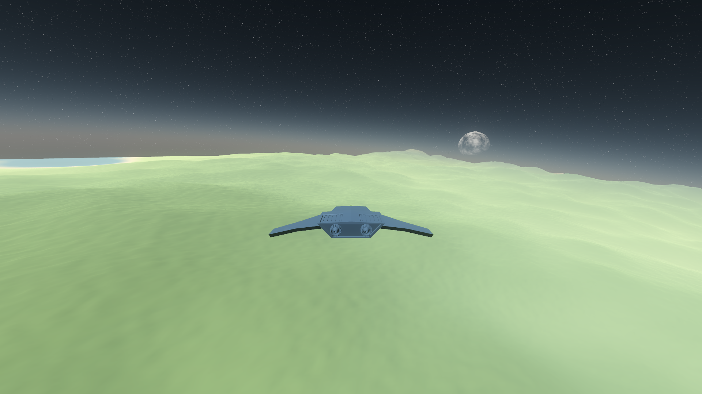
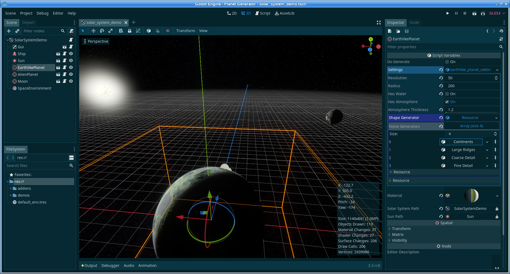

# Planet-Generator 
This is a procedural planet generator addon for the [Godot Engine](https://godotengine.org/) using layered noise functions and dynamic LOD (terrain chunks), written in GDScript.

It's licensed unter MIT, so you can use it for pretty much anything as long as you retain the original license file.

**Table of Contents**
* [Features and Roadmap](#features-and-roadmap)
* [Usage](#usage)
* [Contributing](#contributing)
* [Screenshots](#screenshots)
* [Credits](#credits)

## Features 				and Roadmap

List of completed features and planned features:

* [ ] editor integration
    * [x] configurable `ShapeGenerator` resource
    * [x] configurable `PlanetSettings` resource
    * [x] configurable `NoiseGenerator` resources to layer noise
    * [ ] context-aware editor plugin to ease creation of new planets (settings, noise layers, materials?)
    * [ ] custom inspector plugin for creating and editing above resources
    * [ ] preview texture for NoiseGenerator resource
    * [ ] node based editor for terrain shape / noise generators to allow mixing etc.
* [ ] graphics
    * [x] basic terrain coloring based on height using a gradient texture
    * [x] basic atmosphere shader
    * [x] basic water
    * [ ] texture mapping (triplanar)
    * [ ] better water with reflections and adjustable sea level
    * [ ] cloud layer around planet
    * [ ] bloom and lens flare effects
* [ ] terrain generation
    * [x] quadtree for automatic LOD subdivision of terrain patches
    * [x] seamless terrain patches
    * [ ] terrain collision using `PhysicsServer`
    * [ ] height curve for fine-tuning height levels
    * [ ] different types of `NoiseGenerators`
        * [x] `NoiseGenerator` (standard)
        * [x] `RidgedNoiseGenerator` (generates mountainous ridges)
        * [ ] simple erosion (morphological erosion, dilation, etc.)
        * [ ] generators for other interesting terrain patterns
    * [ ] multiple noise maps:
        * [ ] height map
        * [ ] biome / terrain type map
        * [ ] rivers
    * [ ] more detail on ground level: vegetation, rocks, etc. using instancing
    * [ ] allow generator to output not just straight to geometry but also to heightmaps, values, etc. for offline use
    * [ ] allow building terrain from different inputs like procedural noise but also heightmaps, values, files, etc.
    * [ ] allow mixing of inputs, see also "editor integration" (e.g. heightmap and noise)
* [ ] documentation
    * [x] installing the addon
    * [ ] basic usage
    * [ ] creating new planets
    * [ ] extending the addon
* [x] demo scenes with a spaceship to explore planets
* [ ] other improvements
    * [ ] allow for larger scale (1 Godot unit = 1m? 1km?)
        * [x] use a scene origin shifter to keep player close to origin and thus mitigate lack float precision
        * [ ] use another atmosphere shader which doesn't glitch at higher scale
    * [ ] add simple planetary orbits
    * [ ] add gravity
    * [x] graceful loading and unloading of the addon, solar systems and planets
    * [x] simple benchmark and diagnostics HUD
    * [ ] performance optimization:
        * [x] multithreaded terrain generation using `WorkerThread`
        * [x] `JobQueue` for `TerrainJob` which feeds the worker threads with jobs
        * [ ] explore computing terrain data on the GPU (shaders, rendering to a viewport)
        * [ ] rewrite core parts in C#? (as parallel branch?)
        * [ ] rewrite core parts as GDNative module with C or C++? (as parallel branch?)

## Usage

You need the Godot Engine to use this addon (tested with Godot 3.x.x).

### Quick Start

To quickly get started, open the downloaded folder like a normal project in Godot and run it. You can then navigate a spaceship around the solar system demo scene. The keys are:
* Mouse to rotate ship
* WASD for movement
* hold Shift for faster speed increment
* hold Control to rotate the camera
* F1 to switch generating wireframe meshes on/off
* F2 to switch random coloring of terrain patches on/off

### Using the addon

Download and install the addon as described here [Installing plugins - Godot Engine documentation](https://docs.godotengine.org/en/stable/tutorials/plugins/editor/installing_plugins.html).

**TODO:** Add detailed documentation for setting up planets and their parameters.

For now, check out the solar system demo in `demos/solar_system_demo.tscn` to see how the planets are configured and play around with the settings. A planets needs a `PlanetSettings` resource, which contains a `ShapeGenerator` resource, which in turn has a list of one or more `NoiseGenerator` resources where you can define what the terrain will look like.

## Contributing

* Found a bug? Please open an issue and add all relevant details.
* Got an idea for the project? Open an issue or, if you want to implement it, open a pull request with your feature.
* Want to help out with anything? Clone/Fork the repository and start coding! Pull requests are very welcome.

## Screenshots

Click to enlarge:

 

## Credits

* inspired by [this amazing tutorial](https://www.youtube.com/watch?v=QN39W020LqU&index=2&t=0s&list=PLFt_AvWsXl0cONs3T0By4puYy6GM22ko8) for creating procedural planets by Sebastian Lague
* [atmosphere shader](https://github.com/Dimev/Realistic-Atmosphere-Godot-and-UE4) by Dimas Leenman, shared under the MIT license, slightly adapted
* icons are CC0 from [svgrepo.com](https://svgrepo.com/)
* thanks to [@creative-brain](https://github.com/creative-brain) and [@Valinakova](https://github.com/Valinakova) for ideas
* see [Contributors](https://github.com/Hoimar/Planet-Generator/graphs/contributors)

