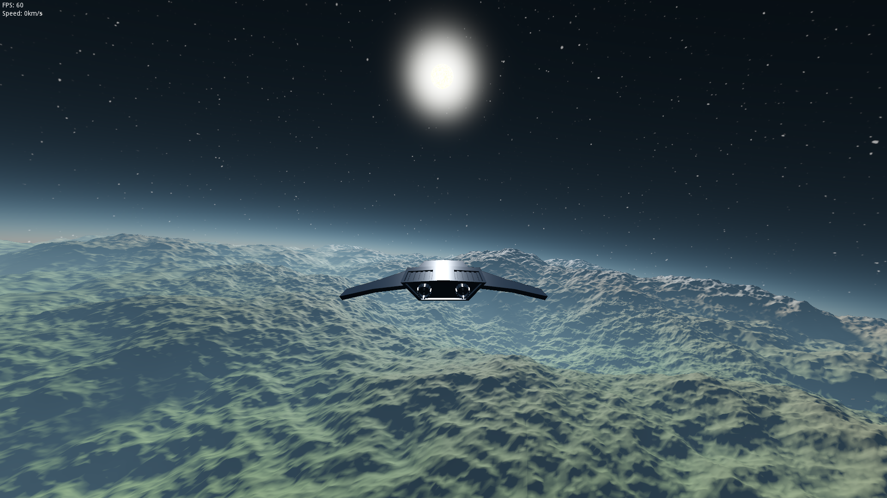
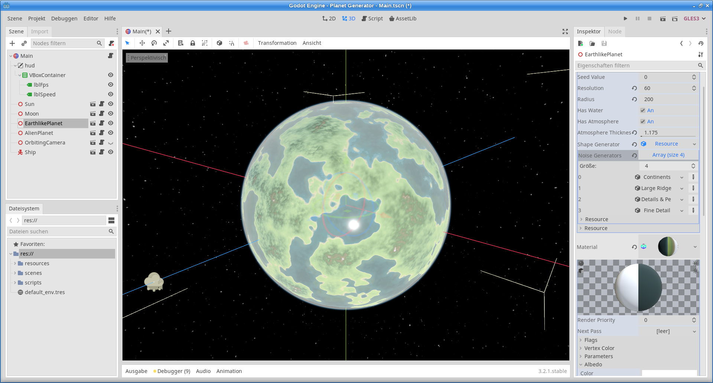

# Planet-Generator
This is a simple, procedural planet generator based on different, layered noise functions with dynamic LOD (terrain chunks), written in GDScript.

# Screenshots

# Credits
* [this amazing tutorial](https://www.youtube.com/watch?v=QN39W020LqU&index=2&t=0s&list=PLFt_AvWsXl0cONs3T0By4puYy6GM22ko8) for creating procedurally generated planets by Sebastian Lague
* [atmosphere shader](https://github.com/Dimev/Realistic-Atmosphere-Godot-and-UE4) by Dimas Leenman, shared under the MIT license, slightly adapted

# TODO
* optimization:
    * TerrainFace generation
    * find hotspots/bottlenecks
    * prioritize threads, limit max. number of threads
    * use C# or a GDNative module for inner loops?
* larger scale to allow for finer detail (needs changes to atmosphere shader due to glitches at larger size)
* fix seams between TerrainFaces, stitch neighboring terrain meshes
* preview texture for NoiseGenerator resource
* cloud layer around planets
* multiple noise maps: one for height, one for biomes and/or one for colors, etc.
* better terrain shaders with textures, noise border between terrain types instead of even borders
* adjustable sea level which will shift the ground level and the water mesh
* vegetation, rocks, etc.
